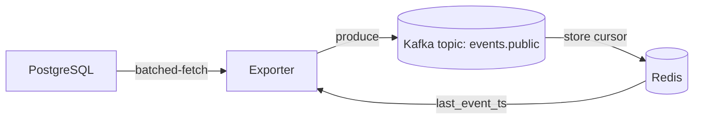

# **KulturaGo_Events-service**




>[!NOTE]
>## REST-API
>
>| Method | Path                                           | Description                           | Request Body (JSON)           | Response Code |
>|:------:|:-----------------------------------------------|:--------------------------------------|:------------------------------|:--------------|
>|  GET   | `/api/v1/events?limit={limit}&offset={offset}` | Список активных событий (постранично) | —                             | `200 OK`      |
>|  GET   | `/api/v1/events/{slug}`                        | Детали события по его `slug`          | —                             | `200 OK`      |
>|  POST  | `/api/v1/events`                               | Создать новый объект события          | `CreateEventInput` (см. выше) | `201 Created` |
>
>

**Пример запроса**

```
{
  "category": {
    "name": "выставка"
  },
  "title": "Выставка искусств Севера",
  "description": "Приглашаем всех!",
  "place": {
    "address": "ул. Ленина, 1, Москва",
    "latitude": 55.751244,
    "longitude": 37.618423
  },
  "starts_at": "2025-11-01T10:00:00Z",
  "ends_at":   "2025-11-01T13:00:00Z",
  "photos": [
    {
      "url": "https://example.com/photos/vsosh-main.jpg",
      "alt_text": "Логотип выставки",
      "is_main": true
    },
    {
      "url": "https://example.com/photos/vsosh-participants.jpg",
      "alt_text": "все",
      "is_main": false
    }
  ],
  "legal_info": [],
  "people": [
    {
      "name": "Фетюков Никита",
      "tag": {
        "name": "Организатор"
      }
    }
  ]
}
```


>[!NOTE]
>## Таблица `event_categories`
>
>| Поле  | Тип             | NULL | По умолчанию | Описание                         |
>|-------|-----------------|------|--------------|----------------------------------|
>| id    | `smallserial`   | ❌   | —            | Первичный ключ                   |
>| slug  | `varchar(32)`   | ❌   | —            | Уникальный человекочитаемый slug |
>| name  | `varchar(64)`   | ❌   | —            | Название категории               |
>
>
>## Таблица `tags`
>
>| Поле  | Тип             | NULL | По умолчанию | Описание                         |
>|-------|-----------------|------|--------------|----------------------------------|
>| id    | `smallserial`   | ❌   | —            | Первичный ключ                   |
>| slug  | `varchar(32)`   | ❌   | —            | Уникальный человекочитаемый slug |
>| name  | `varchar(64)`   | ❌   | —            | Название тега                    |
>
>
>
>## Таблица `places`
>
>| Поле         | Тип                | NULL | По умолчанию | Описание               |
>|--------------|--------------------|------|--------------|------------------------|
>| id           | `bigserial`        | ❌   | —            | Первичный ключ         |
>| title        | `varchar(128)`     | ❌   | —            | Название/заголовок     |
>| country      | `varchar(64)`      | ✅   | —            | Страна                 |
>| region       | `varchar(64)`      | ✅   | —            | Регион/область         |
>| city         | `varchar(128)`     | ❌   | —            | Город                  |
>| street       | `varchar(256)`     | ✅   | —            | Улица                  |
>| house_num    | `varchar(16)`      | ✅   | —            | Номер дома             |
>| postal_code  | `varchar(16)`      | ✅   | —            | Почтовый индекс        |
>| longitude    | `numeric(9,6)`     | ✅   | —            | Долгота                |
>| latitude     | `numeric(9,6)`     | ✅   | —            | Широта                 |
>| created_at   | `timestamptz`      | ❌   | `now()`      | Дата создания записи   |
>
>
>## Таблица `events`
>
>| Поле         | Тип                | NULL | По умолчанию        | Описание                                         |
>|--------------|--------------------|------|---------------------|--------------------------------------------------|
>| id           | `bigserial`        | ❌   | —                   | Первичный ключ                                   |
>| slug         | `varchar(128)`     | ❌   | —                   | Уникальный человекочитаемый идентификатор события|
>| category_id  | `smallint`         | ❌   | —                   | FK → `event_categories(id)`                      |
>| title        | `varchar(64)`      | ❌   | —                   | Название события                                 |
>| description  | `varchar(4096)`    | ❌   | —                   | Описание события                                 |
>| place_id     | `bigint`           | ❌   | —                   | FK → `places(id)` (локация)                      |
>| starts_at    | `timestamptz`      | ❌   | —                   | Время начала                                     |
>| ends_at      | `timestamptz`      | ❌   | —                   | Время окончания                                  |
>| is_active    | `boolean`          | ❌   | `TRUE`              | Флаг активности                                  |
>| created_at   | `timestamptz`      | ❌   | `now()`             | Время создания записи                            |
>| updated_at   | `timestamptz`      | ❌   | `now()`             | Время последнего обновления (триггер)            |
>
>## Таблица `legal_information`
>
>| Поле      | Тип             | NULL | По умолчанию | Описание                             |
>|-----------|-----------------|------|--------------|--------------------------------------|
>| id        | `bigserial`     | ❌   | —            | Первичный ключ                       |
>| event_id  | `bigint`        | ❌   | —            | FK → `events(id)`                    |
>| info_key  | `varchar(64)`   | ❌   | —            | Ключ информационного поля            |
>| info_text | `text`          | ❌   | —            | Текст правовой/дополнительной информации |
>
>
>## Таблица `event_photos`
>
>| Поле       | Тип             | NULL | По умолчанию | Описание                  |
>|------------|-----------------|------|--------------|---------------------------|
>| id         | `bigserial`     | ❌   | —            | Первичный ключ            |
>| event_id   | `bigint`        | ❌   | —            | FK → `events(id)`         |
>| url        | `text`          | ❌   | —            | Ссылка на фотографию      |
>| alt_text   | `varchar(256)`  | ✅   | —            | Альтернативный текст      |
>| is_main    | `boolean`       | ❌   | `FALSE`      | Флаг “главной” фотографии |
>| created_at | `timestamptz`   | ❌   | `now()`      | Время добавления          |
>
>
>
>## Таблица `persons`
>
>| Поле        | Тип              | NULL | По умолчанию | Описание                      |
>|-------------|------------------|------|--------------|-------------------------------|
>| id          | `bigserial`      | ❌   | —            | Первичный ключ                |
>| slug        | `varchar(128)`   | ❌   | —            | Уникальный человекочитаемый slug |
>| name        | `varchar(256)`   | ❌   | —            | Имя/ФИО человека              |
>| description | `text`           | ✅   | —            | Описание персоны              |
>| photo       | `text`           | ❌   | —            | Ссылка на фото                |
>| created_at  | `timestamptz`    | ❌   | `now()`      | Время создания записи         |
>
>
>
>## Таблица `event_people`
>
>| Поле       | Тип           | NULL | По умолчанию | Описание                                 |
>|------------|---------------|------|--------------|------------------------------------------|
>| id         | `bigserial`   | ❌   | —            | Первичный ключ                           |
>| event_id   | `bigint`      | ❌   | —            | FK → `events(id)`                        |
>| person_id  | `bigint`      | ❌   | —            | FK → `persons(id)`                       |
>| tag_id     | `smallint`    | ❌   | —            | FK → `tags(id)`                          |
>| sort_order | `smallint`    | ❌   | `0`          | Порядок сортировки (для вывода людей)    |
>
>
>
>## Таблица `export_cursors`
>
>| Поле           | Тип            | NULL | По умолчанию | Описание                                |
>|----------------|----------------|------|--------------|-----------------------------------------|
>| consumer       | `text`         | ❌   | —            | Имя потребителя                        |
>| last_event_ts  | `timestamptz`  | ❌   | —            | Время последнего экспортированного события |
> 


>[!IMPORTANT]
> ## Запуск сервиса
> 
> **Docker**
> 
> ```shell
> make dc-up
> ```
> данная команда поднимает докер-контейнер и берет зависимости из .env
> 
> ```shell
> make dc-dw
> ```
> данная команда дропает докер-контейнер и удаляет кэш кафки
> 
> **Миграция**
> 
> ```shell
> make migrat
> ```
> запускает миграцию sql-скриптов в DB
> 
> **Git clone**
> 
> ```shell
> git clone https://github.com/samogonshiki/KulturaGo_Events-service.git
> ```

---
**by Finnik**